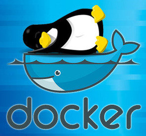

Invitación a Reunión marzo 2017
==================================

Fecha: 2017-03-02 11:00
Autor:  Chico
Categorías: Junta Ordinaria

Se hace una atenta invitación a la reunión ordinaria que se celebrará el __11 de marzo__ en las instalaciones de __Arkebit a las 4:00 pm__.

<!-- break -->

En esta reunión veremos el trabajo de dos de nuestros compañeros, iniciando con Alejandro Hernández Pineda quien mostrará un

## __Servidor de desarrollo Python en Raspberry Pi__

 

Aquí veremos como podemos utilizar una [Raspberry Pi](https://www.raspberrypi.org/) como servidor para aplicaciones web en Python utilizando raspbian, python, django, gunicorn, postgresql, y nginx.

Una vez concluido este tema, seguiremos con 

## __Docker__

 

Ernesto Gutiérrez Muñoz responderá de manera práctica a preguntas como ¿Qué es [Docker](https://www.docker.com/)? y ¿Qué puedo hacer con él? mientras nos enseña a trabajar con esta herramienta a la cual se le agregará el uso de [LAMP](https://es.wikipedia.org/wiki/LAMP).

Todas nuestras reuniones son el segundo sábado de cada mes, y la __entrada es libre.__

Los esperamos :)
