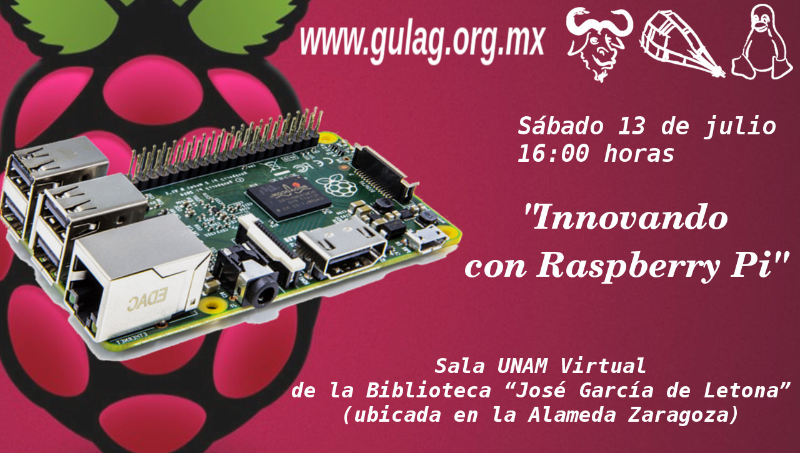

Invitación a reunión julio 2019
==================================

Fecha: 2019-07-07 21:00
Autor:  Chico
Categorías: Junta Ordinaria

Se hace una atenta invitación a la reunión ordinaria que se celebrará el __13 de julio__ en las instalaciones de la __Sala UNAM Virtual__ de la __[Biblioteca "José García de Letona"](https://www.openstreetmap.org/#map=19/25.54029/-103.44524)__ ubicada en la __Alameda Zaragoza a las 4:00 pm__.

<!-- break -->

 

## Innovando con Raspberry Pi

_"Dentro del sector privado así como el público (gobierno) la resistencia a la utilización de software libre así como de hardware libre es mucha, por ello nos dimos a la tarea de encaminar algunas propuestas de software libre como servicios que estuvieran en producción 24/7 para demostrar que son confiables y más seguros que el software privativo, tal es el caso de la creación de un servidor LTSP con Raspberry Pi como clientes ligeros para el trabajo diario, tanto para secretarias como para personal que usa cuestiones más profesionales y que exigen más recursos como autocad o sistemas de cobro; este proyecto está funcionando desde hace 2 años y actualmente lo ampliamos a una sala de capacitación."_

En esta plática nuestro compañero Alejandro Contreras Esquivel nos compartirá su experiencia y los obstáculos con los que se ha encontrado en estos años de implementación.

Si los asistentes desean realizar ahí mismo pruebas, deben llevar el siguiente

## Material (opcional):
* Memoria SD.
* Raspberry Pi (cualquier versión).
* Cargador para Raspberry Pi.
* Monitor hdmi o vga.
* Cable hdmi o vga con convertidor.
* Mouse y teclado.

 

## Usuarios nuevos

Si quieres aprender a usar GNU/Linux, en __[GUI](https://es.wikipedia.org/wiki/Interfaz_gr%C3%A1fica_de_usuario)__ y/o __[CLI](https://es.wikipedia.org/wiki/L%C3%ADnea_de_comandos)__ también te esperamos :) 

 

Todas nuestras reuniones son el segundo sábado de cada mes, y la __entrada es libre.__

Los esperamos :-)
