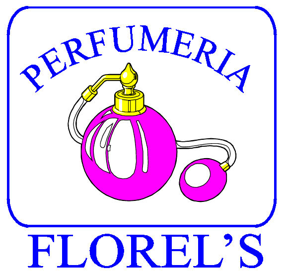

Title: Congreso 2020
Date: 2020-09-01 11:00
Author:  Chico
Category: Eventos
Tags: Eventos, Congreso

 

<!-- break -->

El próximo **19 de septiembre del 2020**, estaremos celebrando nuestro **XV aniversario** y lo festejaremos como siempre lo hacemos, compartiendo conocimiento en el **Congreso**, el cual se celebrará, de manera virtual, desde el **[Instituto Tecnológico Superior de San Pedro de las Colonias](https://www.tecsanpedro.edu.mx/web/)**.

 

Se tendrán las siguientes

### Conferencias:

* **9:00-10:30 horas** "What is 'Libre' Culture and why is it good for Mexico?" - Jon "maddog" Hall.
* **10:30-11:30 horas** "Blender 3D" - Claudia Hernández.
* **11:30-12:30 horas** "Ingeniería social: el arte de hackear tu mente" - Antonio Gurza.
* **12:30-13:30 horas** "Software y datos libres para encontrar Zonas de Silencio de radio" - José Miguel Jáuregui García.

### Link para las conferencias

**Próximamente.**

También contaremos con los siguientes

### Talleres:

* **16:00-18:00 horas** "Livecode" - Edgar Lugo Castro.
* **18:00-21:00 horas** "Ejercicio con Blender para principiantes" - Claudia Hernández.

Cada expositor informará a las personas inscritas el medio para recibir el curso.

La participación a las conferencias y a los talleres será, como siempre, **sin costo**, solamente necesitas registrarte.

### Registro:

Ya pueden registrarse para las conferencias y talleres [aquí](https://forms.gle/HdQsoryCSaXGq9sr5).

Reserven en sus agendas el día **19 de septiembre del 2020**.

Los esperamos :-D

### Patrocinadores:

 

 

 

 

 

 

### Promoción en medios de comunicación:

**Próximamente.**

### Redes sociales:
[Facebook](https://www.facebook.com/groups/282427405174957/)

[Twitter](https://twitter.com/gulagmexico)

[Telegram](https://t.me/joinchat/AhKXM0m4OTrdeN2x2yz1VQ)

### Descargas

* [Poster Congreso de Software Libre 2020 (LowRes)](2020-09-01-avances-congreso-2020/Congreso_2020.jpeg)
* [Poster Congreso de Software Libre 2020 (HiRes)](2020-09-01-avances-congreso-2020/Congreso_2020.png)
* [Poster archivos fuente](https://github.com/GULAG/PosterCongreso2020)

###**Cualquier información adicional, será publicada en ésta pagina.**
