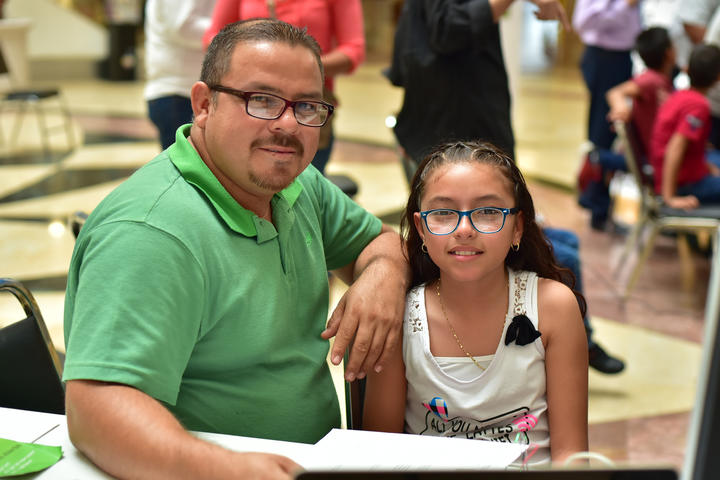

RESUMEN FLISOL 2018
===================

Fecha: 2018-05-28 10:00
Autor: guabyboy
Categorías: Install Fest, FLISOL

 

El pasado sábado 28 de abril, se llevó a cabo el Flisol 2018 en las instalaciones de plaza cuatro caminos.

Se contó con la participación de Alejandro, Osvaldo, Gerardo, Lugo, Palma y su servidor.
Si bien, en esta ocasión no se instaló ninguna distribución o algún tipo de programa, el impacto, considero, fue positivo.

<!-- break -->

 

 
La charla de edición de audio, se convirtió en una amena charla interactiva entre los asistentes, ya que se convirtió en una grata demostración de las bondades del software libre para los amantes de la música.

Definitivamente el uso de la raspberry Pi como consola de videojuegos fue atractivo para las personas que se acercaron, prueba de ello, la mamá con su pequeño. 
Otro acierto fue el de ofrecer el taller de arduino, en el cual se acercaron, no solo niños sino también niñas, una de ellas acompañada de su padre.

#### Una grata experiencia:
El ¿hermano mayor? de uno de unos niños que estuvieron programando los arduinos preguntó a Osvaldo:
- ¿Y dónde se consigue ése programa?
- Lo puedes encontrar en internet si buscas arduino y visualino - le respondió Osvaldo -, lo puedes descargar sin problemas para tu máquina con windows, que es lo que me imagino tienen.
- ¿No es windows lo que usan ustedes?
- No, es GNU/Linux.
- ¿Y no es difícil?
- No, la prueba es que - señalando a un niño - él ha estado usándolo todo este tiempo y otros han jugado sin problema.

Agradecemos el apoyo de la Plaza Cuatro Caminos, en especial a la Lic Gabriela Nava, por las facilidades ofrecidas.

