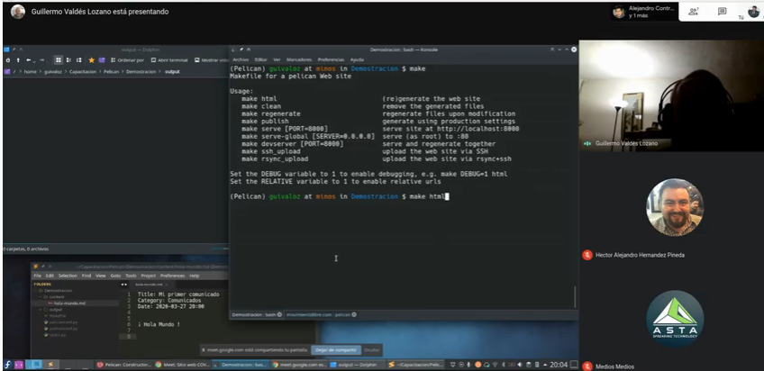

# Hacktoberfest!

## Guia de participacion.

Muchas gracias por apoyar este repositorio dentro de `Hacktoberfest`.
Tenemos varios [`issues`](https://github.com/GULAG/gulag.github.io/issues) listos para este evento.

La idea es migrar los metadatos y fotos de articulos de formato antiguo a formato compatible con `pelican`.

- Un ejemplo de migrar metadatos:

```md
- Version anterior

Invitación a reunión abril 2020
==================================

Fecha: 2020-04-11 14:00
Autor:  Chico
Categorías: Junta Ordinaria

- Compatible con pelican

# Invitación a reunión abril 2020

date: 2020-04-11 14:00
author:  Chico
category: Junta Ordinaria
```

- Un ejemplo de migrar fotos

```html
<!-- Version anterior -->
<center>
<a class="img-responsive" href="2020-04-11-invitacion-reunion-abril/chat.png"></a>
</center>

<!-- Compatible con pelican | agregar {attach} a href y a src -->
<center>
<a class="img-responsive" href="{attach}2020-04-11-invitacion-reunion-abril/chat.png"></a>
</center>

```

### Prerequisitos
1. Tener git instalado y cuenta de github.
2. Editor de texto favorito.
3. Python 3.8+ instalado.


Sigue estos pasos para aportar a este repositorio.

1. Deja un comentario dentro del issue en el que quieres participar. La prioridad son los llamados `Migracion`. 
2. Clona el repositorio.

```bash
# ssh clone - si tienes habilitado verificacion en dos pasos
git clone git@github.com:GULAG/gulag.github.io.git

# http clone
git clone https://github.com/GULAG/gulag.github.io.git
```

3. Entra al folder `gulag.github.io`
```bash
cd gulag.github.io
```

4. Instalar las librerias en `requirements.txt`

```bash
pip install -r requirements.txt
```

5. Crea un branch con el numero del issue.

```bash
git checkout -b issue_<numero de issue>/migracion_<numero de migracion>  

# Ejemplo con issue 9, migracion 1
git checkout -b issue_09/migracion_01
```

6. Haz los cambios mencionados en el issue que escogiste.

7. Para probar tus cambios corre los siguientes comandos.

```bash
# construir el sitio
pelican content -o output -s pelicanconf.py

# correr el sitio en server local
pelican -l -r

# presiona ctrl+c para salir del server local
```

8. Ya que esten listos es hora de hacer tu Pull Request (PR). Corre los siguientes comandos para publicar tu branch con tus cambios en Github.

```bash
git add .
git commit -m 'Mensage concreto de tus cambios'
git push --set-upstream origin issue_<numero de issue>/migracion_<numero de migracion>
```

9. Ahora visita el [repositorio](https://github.com/GULAG/gulag.github.io) en github.com

10. Tu branch debera aparecer junto a un boton que diga `comparar y crear PR` o `compare and create PR`. Dale click.

11. En la siguiente pagina llena el titulo con el numero de issue y nombre.

- Ejemplo:

```
Title: Issue 9 | Migracion 01
```

12. En el cuerpo de la PR explica los cambios que realizaste.

13. No olvides agregar el numero de issue en el cuerpo de la PR.

- Ejemplo:

```
#9
```

14. Esto ligara tu PR con el issue.

15. Agrega el label / etiqueta de `hacktoberfest` a tu PR para que cuente. En `reviewers` agrega a GULAG/Publicadores

16. Dale click al boton `crear PR` / `Create PR`. Eso lanzara el proceso de CI del sitio. Si pasa los checks, felicidades! Tu PR estara lista para hacer `merge`. Espera la revision de alguien del equipo.

17. Si no paso el check de CI. No te preocupes. Revisa el log y trata de nuevo. Manda un comentario y te ayudaremos.
